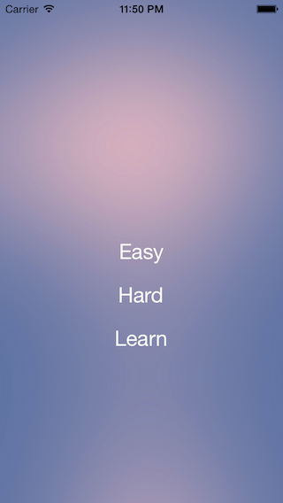
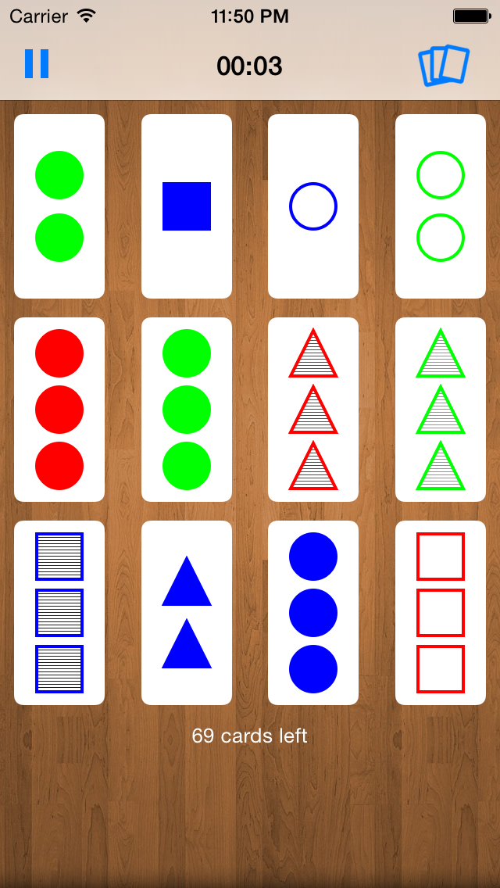
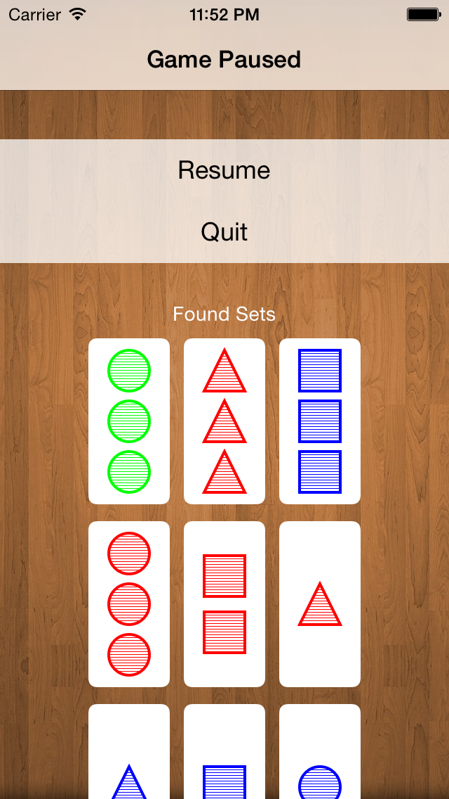

Set-Master
============

Set Master is an iOS clone of the popular Set Card Game. The goal of the game is to format a set. A set is a group of three cards where all the properties are either unique or same. Each set card has four properties. They're color, shape, shading and count. There is always a minimum of twleve cards on the field. If you cannot find a set within the field, then you can draw three more. The game ends when you find all the possible sets.

The game was developed with native Objective-C code and using the Cocoa Touch framework. The card view and shape view are drawn with Core Graphics. The audio is implemented with Core Audio. The game uses a UICollecitonView to display the playing field and UITableView for the menus.

